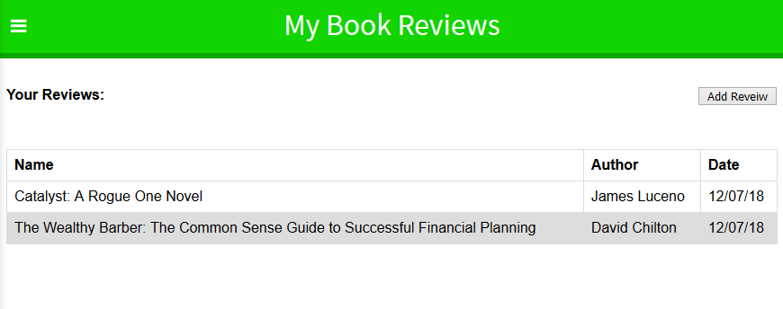

My Book Reviews
================

Checkout the [App](https://my-bookreviews.herokuapp.com)!

Summary
-------
This app enbales users to post reviews about books that they have read, and share it on the landing page so that other's can see what the reviewer's opinon is for that book.

Server-Side API
----------------

The API used for this app holds all of the business logic needed in order for it to function. This includes:

* Registration 
* Logging In
* Adding / Editing / Deleting a review
* Seeing other user's reviews

App Gallery
------------

Homepage / Landing Page

Book Review

Registration / Log In

Profile

User's list of reviews

Add Review

Edit / Delete Review

Technologies Used
-----------------
* HTML
* CSS
* JavaScript
* React JS
* node.js
* mongodb

Author
------
* Gerard Fajardo 
